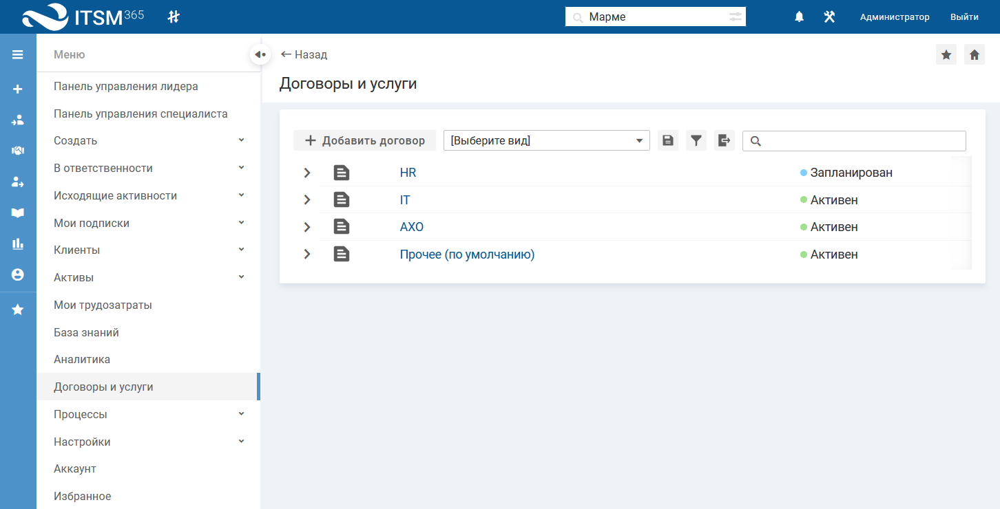
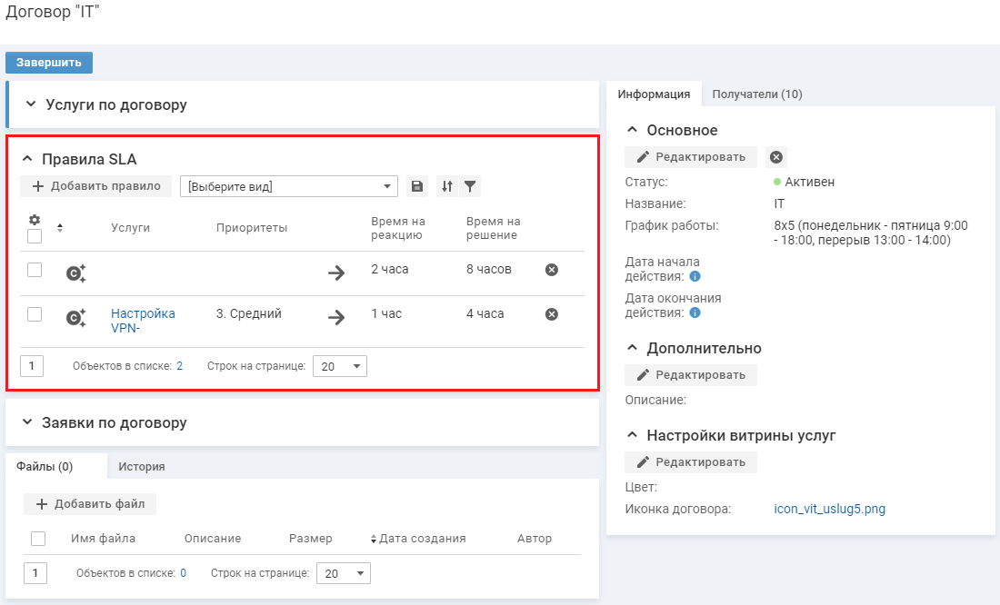

<h1 MadCap:conditions="Default.WEB-HELP" xmlns:MadCap="http://www.madcapsoftware.com/Schemas/MadCap.xsd">Настройка правил для расчета времени на решение заявок</h1><h2 MadCap:conditions="Default.PDF" xmlns:MadCap="http://www.madcapsoftware.com/Schemas/MadCap.xsd">Настройка правил для расчета времени на решение заявок</h2>
Для каждой заявки в параметре "Решить до" рассчитывается дата и время, до которого заявка должна быть выполнена, иначе она будет просрочена.

Значение параметра "Решить до" зависит от параметров: 

<ul class="FirstLevel">
  <li>"Время на решение";</li>
  <li>"График работы";</li>
  <li>"Часовой пояс".</li>
</ul>
Время на решение заявки и график работы сервисного подразделения указываются в договоре

По умолчанию в системе создан договор "Прочее". Данный договор предоставляется всем сотрудникам компании, зарегистрированным в системе.

Все договоры, созданные в системе, отображаются на странице "Договоры и услуги". Чтобы открыть страницу, в левом меню выберите "Договоры и услуги".

  

Страница "Договоры и услуги"

Чтобы открыть карточку договора, нажмите на его название в списке.

Правило вычисления времени на решение заявки (в зависимости от параметров заявки: "Услуга" и "Приоритет") добавляется в карточке договора в списке "Правила SLA".

  </img>

Карточка договора, список "Правила SLA"

График работы сервисного подразделения указывается при добавлении и редактировании договора.

Вы можете использовать базовый договор без изменения, добавить правила расчета времени на решение заявки, добавить новые услуги и договоры или внести изменения в описание базовых. Подробное описание настройки правил SLA, ведения каталога услуг и договоров<MadCap:conditionalText MadCap:conditions="Default.WEB-HELP" xmlns:MadCap="http://www.madcapsoftware.com/Schemas/MadCap.xsd">, см. <MadCap:xref href="../service_catalog/service_catalog.htm">Каталог услуг и договоры</MadCap:xref></MadCap:conditionalText>.

 

<ul class="webHelp">
  <li MadCap:conditions="Default.WEB-HELP" xmlns:MadCap="http://www.madcapsoftware.com/Schemas/MadCap.xsd">Быстрый старт. Шаг 3. <MadCap:xref href="Quick_Start_3.htm">Настройка оповещений по email и уведомлений в интерфейсе</MadCap:xref>.</li>
</ul>
